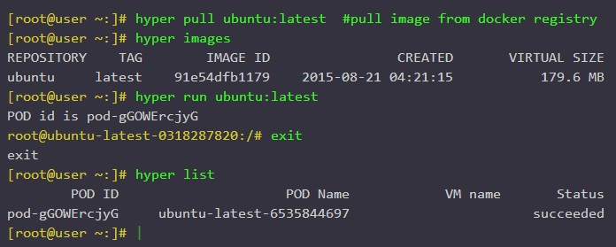

Hyper Container - Hypervisor-agnostic Docker Runtime
====

> This project is the container runtime of [Hyper_](https://hyper.sh), both the `hyperd` daemon 
and the daemon control tool `hyperctl`. If you want to find the source code of the command line client of 
Hyper_, you can find it in [hyperhq/hypercli](https://github.com/hyperhq/hypercli)

## What is Hyper?

**Hyper is a hypervisor-agnostic tool that allows you to run Docker images on any hypervisor**.

## Why Hyper?
-----------

**Hyper combines the best from both world: VM and Container**.

| -  | Container | VM | Hyper | 
|---|---|---|---|
| Isolation | Weak, shared kernel | Strong, HW-enforced  | Strong, HW-enforced  |
| Portable  | Yes, but kernel dependent sometimes | No, hypervisor dependent | Yes, hypervisor agnostic and portable image |
| Boot  | Fast, sub-second  | Slow, tens of seconds  | Fast, sub-second  |
| Performance  | Great | OK| Good, minimal resource footprint and overhead |
| Immutable | Yes  | No, configuration management required | Yes, only kernel+image  | 
| Image Size| Small, MBs  | Big, GBs  | Small, MBs  |
| Compatibility | No, need new tools | Great, everything just works  | Good, it is still a "Machine", much less changes  |
| Mature   | Not yet  | Production ready, SDN, SDS, LiveMigration, etc.  | Yes, just plug-&-play|
| ROI| Rebuild everything with container  | - | Reuse your virtual infrastructure  |

> **BYOK* = bring your own kernel

## Requirements

- QEMU 2.0 or later
- Xen 4.5 and VT enabled host (for Xen support)

## Installation

Ensure you are running Linux (kernel 3.8 or later) and have Docker
(version 1.5 or later) and QEMU (version 2.0 or later) installed. Then download the [binary tarball](https://hyper-install.s3.amazonaws.com/hyper-latest.tgz) and install it directly.

For RHEL/CentOS 7.x, you can use our [RPMs](http://docs.hypercontainer.io/get_started/install/linux.html)

To run *hyper*, just type `hyperctl` if you've installed packages.

For information on using the command line, just type `hyperctl`. You may use
`hyperctl <command> --help` for detailed information on any specific command.

## Example

## Build From Source

Clone hyper and runv in GoPath

    > mkdir -p ${GOPATH}/src/github.com/hyperhq
    > cd ${GOPATH}/src/github.com/hyperhq
	> git clone https://github.com/hyperhq/runv.git runv
	> git clone https://github.com/hyperhq/hyper.git hyper

And make sure you have `go` (>= 1.4) , `device-mapper-devel`, and `autotools`, go into the `hyper` dir

    > ./autogen.sh
    > ./configure
    > make

Then you can get the binaries `hyperd` daemon and `hyperctl` cmdline tool.

You may also need the kernel and initrd from [HyperStart](https://github.com/hyperhq/hyperstart) to run your own hyper.

## Find out more

 * [Documentation](https://doc.hyper.sh)
 * [Get Started](https://doc.hyper.sh/get_started/index.html)
 * [Reference](https://doc.hyper.sh/reference/index.html)
 * [Release Notes](https://doc.hyper.sh/release_notes/latest.html)

## Contact Us

Found a bug, want to suggest a feature, or have a question?
[File an issue](https://github.com/hyperhq/hyper/issues), or email <bug@hyper.sh>. When reporting a bug, please include which version of
hyper you are running, as shown by `hyperctl --version`.

* Twitter: [@hyper_sh](https://twitter.com/hyper_sh)
* Blog: [https://hyper.sh/blog.html](https://hyper.sh/blog.html)
* Slack: [#hyper](https://slack.hyper.sh/) (The IRC has been migrated to slack.)
